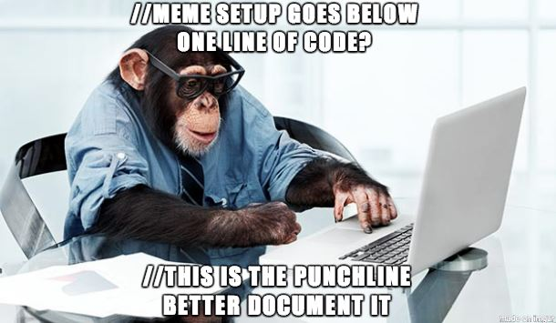

# 0x19. Postmortem

    

## Issue Summary:
At approximately 10:00 a.m. on December 23, some of our users are having difficulty loading our website. The BackOffice team began to receive queries and requests from users who were unable to access our platform. The event fired at 10:05 and what happened: A programmer made a typo in the last update to our code base, this error caused our website to fail to load properly and stop with an error, which caused the server to go down, the event in question was detected by the monitoring system at 10:07 which set off alarms and the development team was notified, who began working to find and fix the problem. immediate. This event affected 45% of users in Latin America.

## Timeline:
- **09:45 UTC:** A new update has been uploaded to our website codebase
- **10:00 UTC:** Our BackOffice team started receiving emails from users who had problems loading our website
- **10:04 UTC:** Our monitoring system triggered an alert indicating that the website was down
- **10:07 UTC:** The team received the alert and began working to fix the issue.
- **10:16 UTC:** The team ran some tests and found that the cause was a typo in a library name in an import statement
- **10:20 UTC:** The team fixed the bug and ran tests to make sure it was resolved correctly
- **10:22 UTC:** The corrected version of the code was uploaded to the server
- **10:24 UTC:** The website is back up and running

Root cause and resolution:

Corrective and preventative measures:
